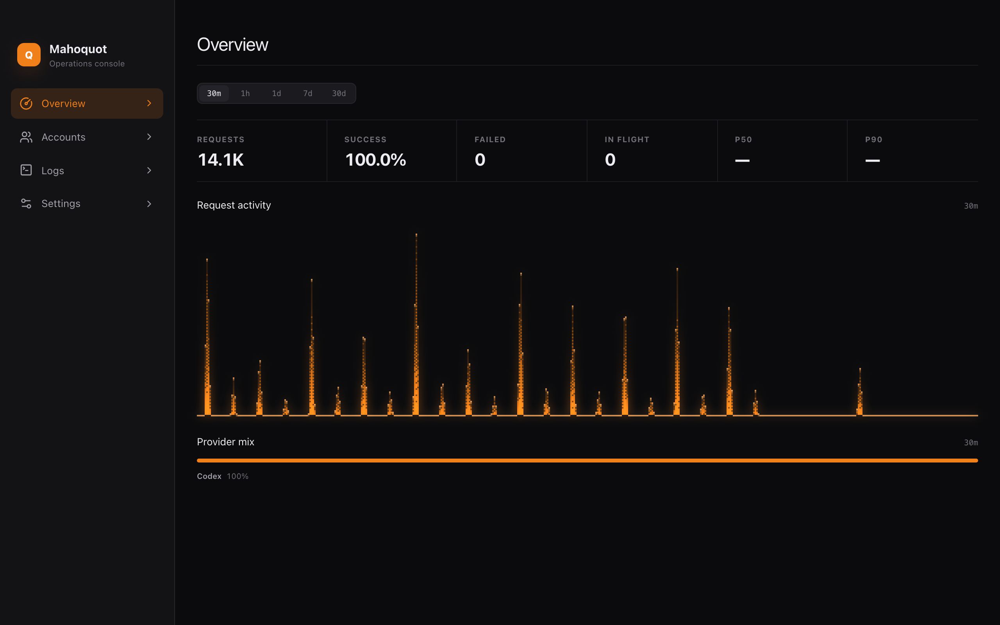
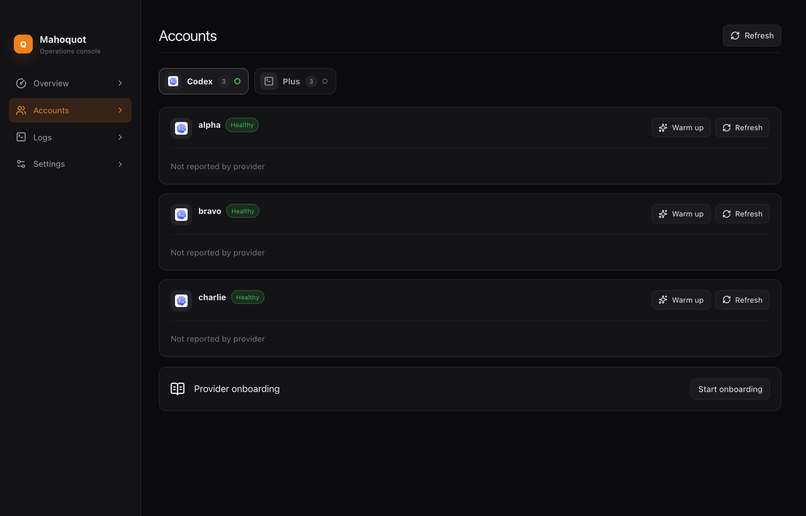

<p align="center">
  
</p>

<h1 align="center">Mahoquot</h1>

<p align="center">
  High-concurrency LLM inference proxy and account router written in Rust with an operations console.
</p>

<p align="center">
  <a href="./AGENTS.md">Architecture</a> &bull;
  <a href="./PRODUCT.md">Product Contract</a> &bull;
  <a href="./DESIGN.md">Design Tokens</a> &bull;
  <a href="./docs/CONTRACTS.md">Protocol Contracts</a> &bull;
  <a href="./docs/reference-parity.md">Provider Reference</a>
</p>

---

## Overview

Mahoquot routes inference traffic across subscription pools for Codex, Claude, Gemini, Antigravity, Cursor, Kiro, and Z-code. It distributes requests across upstream accounts with monotonic round-robin fairness, automatic OAuth token refreshing, pre-first-byte in-flight failover, and lock-free runtime configuration. It provides a drop-in replacement for the CLIProxyAPI management surface (129 routes).

<p align="center">
  
</p>

<p align="center">
  
</p>

---

## Core Capabilities

- **Sequence-stamped round robin**: Monotonic rotation that survives account churn, cooldown, and recovery without double-serving or counter resets.
- **Pre-first-byte failover**: Automatic retries across up to `min(pool_available, 3)` distinct accounts on 429, 401, 403, 500, 502, 503, and 504 before any downstream byte is committed.
- **Zero-copy passthrough**: No body parsing on matched-family routes. Pooled hyper client per upstream host with `TCP_NODELAY`.
- **Lock-free configuration**: `ArcSwap` on the request hot path. Settings persist atomically to YAML with zero downtime and no restart needed.
- **Automatic OAuth refresh**: Credentials live as OAuth account files on disk; expired tokens refresh automatically in the background.

---

## Desktop Application

The desktop application bundles the gateway as a managed native process.

### Quick Start

1. **Clone the repository**:
   ```bash
   git clone --recurse-submodules https://github.com/Indosaram/mahoquot.git
   cd mahoquot
   ```
   *(If cloned without `--recurse-submodules`, the build process automatically initializes and fetches the `mahoquot-proxy` submodule.)*

2. **Run in development**:
   ```bash
   bun install
   bun run dev
   ```
   Or launch directly via Cargo:
   ```bash
   cargo run -p mahoquot-monitor-ui
   ```

3. **Build production app bundle**:
   ```bash
   bun install
   bun run build
   ```
   Generated native packages are placed under `target/release/bundle/`:
   - macOS: `.app`, `.dmg`
   - Linux: `.deb`, `.rpm`
   - Windows: `.exe` (NSIS setup), `.msi` (WiX)

---

## Standalone Proxy

The proxy core can run headless without the desktop UI. It is maintained in [`mahoquot-proxy`](https://github.com/Indosaram/mahoquot-proxy) (submodule at `./mahoquot-proxy` or sibling checkout `../mahoquot-proxy`).

```bash
cd mahoquot-proxy
cargo build --release --bin mahoquot-gateway
./target/release/mahoquot-gateway serve --auth-dir ~/.mahoquot/auth
```

---

## Verification

Run all repository quality gates with one command:

```bash
bash scripts/verify.sh
```

Gates executed:
- `cargo fmt --check`
- `cargo clippy -D warnings`
- `cargo test --workspace`
- Frontend typecheck (`tsc --noEmit`), lint (`biome check`), and unit tests (`vitest`)
- Desktop E2E contracts (`playwright test`)
- Embedded console drift check across repos

---

## Benchmarks

Benchmark methodology follows [`results/ARCH-REVALIDATION.md`](./results/ARCH-REVALIDATION.md): paired within-round comparison, randomized tier order, warmup round discarded, deterministic mock upstream with a 40 ms TTFT floor, measured on Apple M4 Max (macOS arm64).

- **Tier A**: Direct mock (floor)
- **Tier B**: CLIProxyAPI v7.2.140 (Go incumbent)
- **Tier C**: mahoquot-gateway (Rust)

### Protocol Translation Performance

Workload: Two-way translation between OpenAI and Codex responses at 500 concurrent streams across 6 kept rounds (median values). Full details: [`results/FAIR-TRANSLATION-BENCH.md`](./results/FAIR-TRANSLATION-BENCH.md).

| Load Point | Tier | p50 TTFT (ms) | p99 TTFT (ms) | Throughput (RPS) |
|---|---|---|---|---|
| 20 chunks | A (Direct) | 42.1 | 83.3 | 9,004 |
| 20 chunks | B (CLIProxyAPI) | 54.1 | 130.7 | 6,998 |
| 20 chunks | C (mahoquot-gateway) | 44.1 | 78.4 | 8,622 |
| 200 chunks | A (Direct) | 43.7 | 94.3 | 8,697 |
| 200 chunks | B (CLIProxyAPI) | 107.7 | 467.0 | 1,314 |
| 200 chunks | C (mahoquot-gateway) | 57.2 | 139.1 | 4,747 |

At 20 chunks, mahoquot delivers +10.5 ms p50 / +43.7 ms p99 improvements. At 200 chunks, advantages scale to +49.8 ms p50 / +311.8 ms p99 over the Go incumbent.

### Streaming Relay Cost

- **Per-chunk relay overhead**: ~58 us/chunk (mahoquot) vs ~378 us/chunk (CLIProxyAPI) (~6.5x difference).
- **Long streaming throughput**: Under extended 200-chunk streams at 500 concurrent streams, mahoquot maintains 4,971 RPS while the incumbent drops to 1,314 RPS.
- **Failover handling**: Injected 429 retries resolve within budget with 0 client-visible errors; unresolvable exhaustion gracefully sheds load with immediate 503 responses while preserving account round-robin balance.

### Reproducing Benchmarks

```bash
cargo build --release -p bench

# 1. Deterministic mock upstream (40 ms TTFT floor, 20 SSE chunks)
target/release/bench mock --port 18850 --ttft-ms 40 --chunks 20

# 2. Run paired load test against tiers
target/release/bench run --concurrency 500 --total 2000 --timeout-ms 15000
```
*(Use ports in the 18840-18899 range for isolated testing.)*
